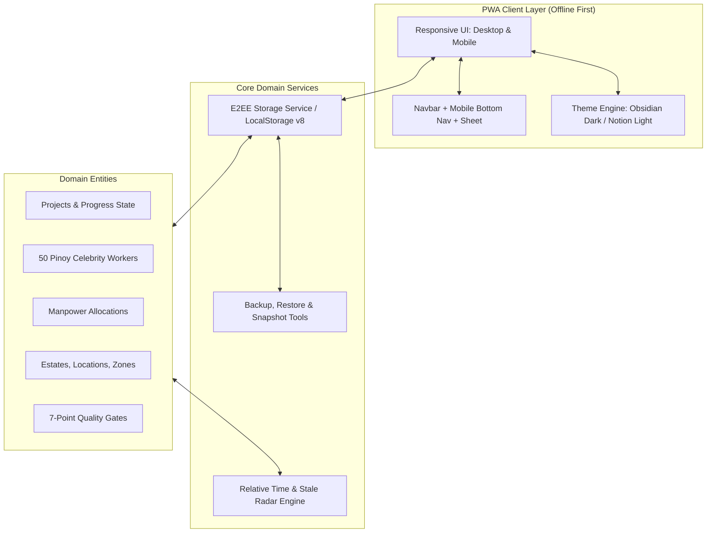

# BuildFlow — Project Blueprint & Technical Specification

> **Target Platform:** Progressive Web App (PWA) — Fully responsive across desktop, tablet, and mobile.  
> **Aesthetic Archetype:** Modern Obsidian VIP Dark (Default) & Warm Notion Light — Clean typography, subtle borders, high information density, and zero clutter.  
> **Core Metaphor:** Multi-file download queue with dynamic progress bars, instant status telemetry, and rapid scrubbing.  
> **Domain:** VIP Construction, Renovation & Property Maintenance Management (Luxury Estates, Executive Offices, and Private Compounds).

---

## 0. Operational Principles & Simplification Guidelines

1. **Lead / Supervisor Portal (Zero Worker Phone Dependency):**  
   *The constraint:* Field technicians and workers are strictly prohibited from carrying smartphones on-site for client privacy and security.  
   *The design:* BuildFlow operates exclusively on supervisor and project lead devices. Manpower allocation occurs at the crew/squad level with individual selection from the deployable roster.

2. **Focused Operations over Heavy ERP:**  
   *The principle:* Avoid bloat from payroll, biometric attendance, or accounting. BuildFlow concentrates purely on **Project Progress + Manpower Distribution + Quality Gate Checklists + Executive Reporting**.

3. **Pre-Flight Quality Gate Checklists:**  
   *The principle:* Proposal submissions and daily reports must pass a mandatory 7-point pre-flight checklist before delivery to the client (stock verification, manpower, timeline, multiple options, design pegs, physical swatches, pros/cons matrix).

4. **The "File Download Manager" Metaphor:**  
   *The principle:* Eliminates overwhelming Gantt charts and complex burn-down widgets. Each project row resembles a high-utility browser download item:
   - What is it? (Project name, Estate, Building, and Specific Work Area)
   - How far along is it? (Interactive progress bar `0–100%`)
   - What is the current milestone? (1-sentence clear description)
   - When did it last move? (Relative timestamp, e.g., `45m ago`)
   - Is it stalled? (Automated Stale Radar indicator)
   - Quick actions (Update progress, open checklist, reassign crew, view details)

5. **Everyday English Simplicity:**  
   *The principle:* All technical and operational terms use plain, straightforward English:
   - `Properties & Buildings` (instead of Dynamic Hierarchy Hub)
   - `Work Areas & Zones` (instead of Specific Zones Hub)
   - `Team Roster & Workers` (instead of Workforce Hub)
   - `Project Approval Checklist` (instead of Pre-Flight Submission Gate)
   - `Daily Operations Summary` (instead of VIP Executive Daily Report Deck)
   - Complete elimination of military/aviation jargon ("Cockpit", "Telemetry", etc.).

---

## 1. Product Requirements Document (PRD)

### 1.1 Problem Statement & Context
Operations oversee high-value properties spanning luxury residences, corporate offices, and private estates. Priorities and crew assignments shift continuously across work areas. Clients demand spotless daily progress and reject any proposal lacking alternatives, material stock validation, or comparative pros/cons.

Because workers cannot use phones on-site, the reporting and allocation burden rests entirely on supervisors. BuildFlow gives them a frictionless, responsive tool to update progress in under 30 seconds, shift manpower instantly, enforce strict submission quality, and export daily executive digests.

### 1.2 User Personas
| Persona | Role | Key Jobs to be Done |
| :--- | :--- | :--- |
| **Site Supervisor / Operations Lead** | Daily Field Manager | Allocate deployable staff; log progress in <30s; run pre-submission checklists; track overdue proposals; manage work areas and roster. |
| **VIP Client / Principal Representative** | Asset Owner / Decision Maker | Inspect high-level daily progress across properties; review proposal options without ambiguity; unblock stalled tasks. |
| **Operations Coordinator** | Project Back-office | Maintain property/zone hierarchies; manage trade specialties; import worker rosters; export encrypted backups. |

### 1.3 Goals & Success Metrics
- **Zero-Rejection Submissions:** 100% of proposals submitted pass the mandatory 7-point compliance checklist.
- **Reporting Speed:** Daily status entry for all active projects completed in under 5 minutes total.
- **Overdue Detection:** Zero stale projects (>24h without update) or proposals (>48h without feedback) go unnoticed.
- **100% Dynamic Taxonomy:** Zero hardcoded locations or trades; properties, zones, categories, and specialties can be created, edited, and deleted at runtime.
- **Mobile First & Responsive:** Seamless usability on smartphones (`<768px`) with a native-feeling single-row header, 4-tab bottom navigation, and tools bottom sheet.
- **PWA Ready:** Installable standalone web app across Android, iOS, and desktop browsers with custom installation banner.

### 1.4 Feature Requirements Matrix

#### A. Projects Queue (Download Dashboard)
- **Interactive Progress Bar Row:** Visual bar showing `0–100%` completion with color-coded status states (`Active`, `Paused`, `Completed`).
- **Position-Locked Scrubbing:** Incremental `-5%` and `+5%` buttons immediately update project percentage and timestamps while strictly maintaining card row order (no erratic jumping to top of queue).
- **Multi-Line Stage Text:** Stage descriptions wrap cleanly across lines without horizontal ellipsis truncation, ensuring thorough field progress logs remain completely readable on compact mobile screens.
- **Mobile KPI Grid:** Summary telemetry stat cards stack into a clean 2-column grid on mobile viewports.
- **Metadata Pills:** Property & Building tag, Work Area tag, assigned crew headcount badge, priority badge, and relative update timestamp (`25m ago`, `yesterday`).
- **Filters & Search:** Real-time search across titles, stages, properties, and filter pills (`All Projects`, `Residential`, `Offices`, `Estate Grounds`, `Completed`).

#### B. Projects Manager (Table Grid Hub)
- Full-featured data table view (`?tab=projects_table`) for managing all projects with sortable columns.
- Inline status changers (`Active`, `Paused`, `Completed`) and stage description editor.
- **Direct Row Deletion:** Unconditional trash button in the Actions column permitting rapid project deletion, protected by a custom danger confirmation modal.
- 1-click links to Checklist modal, Proposals modal, Manpower drawer, and Project Inspector.

#### C. Progressive Web App (PWA) & Standalone Capabilities
- **Web App Manifest (`manifest.json`):** Full standalone mode, portrait orientation, theme color `#0e1217`, background color `#0e1217`, and shortcut links.
- **App Icons:** High-resolution SVG maskable and standard app icons (`icon.svg`).
- **Custom PWA Install Prompt:** React banner component listening to `beforeinstallprompt` on Chromium browsers, offering a 1-click "Install BuildFlow" action. Includes dedicated iOS Safari walkthrough ("Tap Share -> Add to Home Screen").

#### D. Universal Custom Modal Dialogs (Zero Native Browser Popups)
- **Global Promise-Based Dialogs:** Universal replacement for `window.alert()` and `window.confirm()` via `showAlert()` and `showConfirm()`.
- **Semantic Variants:** Tailored glassmorphic modal styling for `danger` (red), `warning` (amber), `info` (blue), and `success` (emerald).
- **Security & Integrity Notice:** Clear warning callouts for destructive actions (e.g., project deletion, record resets).
- **Accessibility & Focus:** Supports `Enter` to confirm, `Escape` to cancel, and backdrop click dismissal.

#### E. Crew Allocator & Manpower Board
- **Live Roster Pool:** Tracks on-site deployable staff vs. restricted/off-site personnel.
- **Quick Reassignment Drawer:** Reallocate headcount or specific workers between projects without drag-and-drop complexity.
- **Bench Capacity Counter:** Live indicator showing currently deployed crew vs. available bench capacity.

#### F. Team Roster & Workers Hub
- **Pinoy Male Celebrities:** Pre-seeded with 50 iconic Filipino personalities (*Piolo Pascual, Jericho Rosales, Dingdong Dantes, Coco Martin, Alden Richards, Daniel Padilla, etc.*) with high-definition portrait avatars.
- **Pagination:** Fixed 25 items per page (`pageSize = 25`), with dynamic counter (`Showing 1–25 of 50 workers`), page pills (`[1]`, `[2]`), and Next/Prev buttons.
- **Worker Management:** Add single worker with photo URL preview or 8 preset avatars; toggle availability (`Available on-site` vs. `Off-site / Restricted`); edit and delete capabilities.
- **Bulk Import Modal:** Admin utility to paste multi-line worker lists (`Full Name, Trade`) with instant parsing and sample list generator.

#### G. Mandatory 7-Point Quality Gate Checklist
Submissions cannot be locked or delivered to the client until all 7 items pass:
1. **Material Availability in Stock:** Verified on-site or in warehouse.
2. **Assigned Manpower:** Number of deployable hands confirmed.
3. **Timeline & Milestones:** Expected start and completion dates established.
4. **Multiple Options Provided:** At least 2–3 viable design/execution options.
5. **Design Pegs & Inspiration:** Curated visual references attached/referenced.
6. **References & Physical Samples:** Physical swatches/samples prepared for client review.
7. **Pros & Cons Matrix:** Clear trade-offs detailed for each option.

#### H. Stale Project & Proposal Radar
- **Project Stale Detector:** Automatically flags projects without updates for >24 hours.
- **Proposal Stale Detector:** Highlights proposals awaiting client feedback for >48 hours.
- **1-Click Follow-Up Draft:** Generates a polite, copyable VIP reminder message.

#### I. Mobile Layout & Bottom Sheet Navigation
- **Single-Row Mobile Header:** Fixed `52px` header height with `flex-wrap: nowrap` preventing menu buttons from wrapping and colliding with project telemetry labels. Desktop-redundant action buttons are hidden on mobile header.
- **User Identity Chip:** Integrated user avatar and name pill; Lock & Sign Out action positioned adjacent to Settings icon.
- **Fixed Bottom Tab Bar:** 4 clean items at `<768px`:
  - 🏠 **Home** (Blue `#3b82f6`) — Projects Queue
  - 📋 **Manager** (Orange `#f59e0b`) — Projects Table Manager
  - 📄 **Reports** (Purple `#8b5cf6`) — Daily Operations Digest
  - ⋯ **More** (Three dots icon) — Toggles the Navigation & Tools bottom sheet
- **Navigation & Tools Bottom Sheet:**
  - Top pill drag handle, header with circular close `X` button.
  - 2-column card grid with custom squircles for administrative and data management hubs.

#### J. Authentication & Clean Workspace Lifecycle
- **Clean Workspace Default:** Standard username/password login clears all previous session records (`storage.clearAllData()`), providing an unpolluted slate.
- **1-Click Supervisor Demo:** Instantly re-populates the complete 4-project, 50-worker sample database (`storage.loadSampleData()`).
- Removed redundant and dangerous sample reset items from the global menu bar dropdown.

#### K. Dual Theme Modes & Wide Stretch Layout
- **Obsidian Dark (Default):** Deep slate `#0e1217` surfaces optimized for high-contrast field viewing.
- **Notion Light:** Warm monochrome `#f7f6f3` paper-like canvas.
- **1480px Stretch Container:** Expands comfortably on widescreen displays with `28px` margins while remaining mobile-responsive.

---

## 2. Technical Architecture

### 2.1 System Architecture Diagram



### 2.2 Tech Stack
- **Framework:** React 19 with TypeScript
- **Build Tool:** Vite 6 (Ultra-fast HMR and optimized production bundle)
- **Styling:** Vanilla CSS Design System with CSS Custom Properties (Zero Tailwind dependency; custom tokens for colors, surfaces, borders, and shadows)
- **Icons:** Lucide React
- **Storage:** LocalStorage with versioned initialization (`buildflow_initialized_v8`) and automated seeding

---

## 3. Data Schema & Domain Models

### 3.1 Core Entity Definitions (TypeScript)

```typescript
// Estate / High-Level Property
export interface Estate {
  id: string;
  name: string;             // e.g. 'Grand Sanctuary (69k sqm)'
  type: 'residential' | 'office' | 'estate' | 'other';
  totalAreaSqm?: number;
  address?: string;
  isActive: boolean;
  createdAt: string;
  updatedAt: string;
}

// Building or Structure within Estate
export interface Location {
  id: string;
  estateId: string;
  name: string;             // e.g. 'Main Manor', 'Executive Tower'
  buildingCode?: string;
  isActive: boolean;
  createdAt: string;
}

// Specific Work Area within Building
export interface Zone {
  id: string;
  locationId: string;
  name: string;             // e.g. 'Roof Deck', 'Kitchen', 'Meeting Room 50A'
  floorOrLevel?: string;
  notes?: string;
  isActive: boolean;
  createdAt: string;
}

// Worker / Employee Record
export interface Employee {
  id: string;
  externalPwaId?: string;
  fullName: string;         // e.g. 'Piolo Pascual'
  tradeSpecialty: TradeSpecialty;
  isDeployable: boolean;    // Available on-site vs off-site
  isActive: boolean;
  avatarUrl?: string;       // High-res portrait photo URL
  contactNotes?: string;
  createdAt: string;
}

// Project & Progress Telemetry
export interface Project {
  id: string;
  zoneId: string;
  title: string;            // e.g. 'Roof Waterproofing'
  category: ProjectCategory; // 'construction' | 'renovation' | 'maintenance' | 'proposal'
  status: ProjectStatus;     // 'active' | 'paused' | 'awaiting_feedback' | 'stale' | 'completed'
  progressPercentage: number; // 0 to 100
  currentStageSummary: string; // e.g. 'Applying waterproof seal'
  priority: PriorityLevel;   // 'low' | 'normal' | 'high' | 'vip_urgent'
  targetStartDate?: string;
  targetCompletionDate?: string;
  lastProgressUpdatedAt: string;
  createdAt: string;
  updatedAt: string;
}

// Manpower Allocation
export interface ManpowerAllocation {
  id: string;
  projectId: string;
  employeeId: string;
  isLead: boolean;
  assignedDate: string;
  createdAt: string;
}
```

---

## 4. Active Sample Dataset (4 Projects & 50 Workers)

### 4.1 Sample Projects
1. **Grand Sanctuary: Roof Waterproofing**  
   - *Property:* Grand Sanctuary (69k sqm) → Main Manor → Roof Deck  
   - *Status:* Active (82%) • Renovation • High Priority  
   - *Current Stage:* *"Applying waterproof seal on roof deck. Water testing tomorrow."*  
   - *Crew Assigned:* 4 workers (Piolo Pascual, Jericho Rosales, Dingdong Dantes, Coco Martin)

2. **Crown Villa: Pool Deck Refinishing**  
   - *Property:* Crown Villa → Pool Compound → Pool Deck  
   - *Status:* Active (64%) • Construction • Normal Priority  
   - *Current Stage:* *"Sanding wooden deck planks and applying protective outdoor seal."*  
   - *Crew Assigned:* 3 workers (Alden Richards, Daniel Padilla, Enrique Gil)

3. **Harbor Crest: Kitchen Countertop Install**  
   - *Property:* Harbor Crest → Main House → Kitchen  
   - *Status:* Paused (35%) • Renovation • VIP Urgent  
   - *Current Stage:* *"Waiting for client to choose countertop color and design."*  
   - *Crew Assigned:* 2 workers (James Reid, Paulo Avelino)

4. **Executive Offices: Meeting Room Soundproofing**  
   - *Property:* Executive Offices → Tower 1 → Meeting Room 50A  
   - *Status:* Completed (100%) • Renovation • Normal Priority  
   - *Current Stage:* *"Wall panels installed and sound tested. Ready for use."*  
   - *Crew Assigned:* 2 workers (John Lloyd Cruz, Gerald Anderson)

### 4.2 Sample Workforce (50 Pinoy Male Celebrities)
- **Names:** Piolo Pascual, Jericho Rosales, Dingdong Dantes, Coco Martin, Alden Richards, Daniel Padilla, Enrique Gil, James Reid, Paulo Avelino, John Lloyd Cruz, Gerald Anderson, Richard Gutierrez, Derek Ramsay, Xian Lim, Dennis Trillo, Zanjoe Marudo, Enchong Dee, Matteo Guidicelli, Carlo Aquino, Sam Milby, Diether Ocampo, Vhong Navarro, Joshua Garcia, Donny Pangilinan, Ian Veneracion, Edu Manzano, Richard Gomez, Aga Muhlach, Gabby Concepcion, Robin Padilla, Cesar Montano, Christopher de Leon, Tirso Cruz III, Gary Valenciano, Martin Nievera, Ogie Alcasid, Dingdong Avanzado, Ariel Rivera, Janno Gibbs, Randy Santiago, Rayver Cruz, Rodjun Cruz, Mark Herras, Marvin Agustin, Baron Geisler, John Arcilla, Mon Confiado, Sid Lucero, Jake Cuenca, Ronnie Alonte.
- **Photos:** 20 Unsplash portrait images distributed across workers.
- **Pagination:** 25 workers per page (Page 1: workers 1–25; Page 2: workers 26–50).

---

## 5. User Journeys & Interface Specifications

### 5.1 Supervisor Daily Progress Logging (< 30 Seconds)
```
1. Open BuildFlow on tablet or desktop (http://localhost:5173).
2. Default view loads: Projects Queue with 4 active project download bars.
3. Locate "Grand Sanctuary: Roof Waterproofing" (currently 82%).
4. Click "+5%" or drag progress slider to 87%.
5. Click stage summary text to update note: "Waterproof seal completed. Flood testing initiated."
6. Telemetry updates optimistically in <16ms; Last Updated changes to "Just now".
```

### 5.2 Mobile Navigation Flow (Images 2 & 3 Reference)
```
1. Access BuildFlow on mobile device (<768px).
2. Top desktop navigation links hide cleanly.
3. Fixed bottom navigation bar displays 4 items:
   - [Home] (Blue house)
   - [Manager] (Orange grid)
   - [Reports] (Purple document)
   - [More] (Three dots)
4. Tap [More]:
   - Bottom sheet slides up smoothly with top drag handle.
   - 2-column card grid displays all tools (Crew Allocator, Team Roster, Properties, Zones, Categories, Priorities, Trades, Approval Rules, Stale Radar, Theme Toggle, Sample Data, Sign Out).
5. Tap [Team Roster]:
   - Navigates immediately to Roster view.
   - Bottom sheet auto-closes without flicker.
   - Shows 25 celebrity workers per page with pagination controls.
```

### 5.3 Locking & Signing Out (Image 1 Reference)
```
1. Click [Sign Out] in top header or bottom sheet.
2. Custom LogoutConfirmModal appears (replacing native browser alert):
   - Red LogOut icon badge
   - "Lock BuildFlow Session?"
   - "Lock BuildFlow and return to login screen? You will need your supervisor credentials to unlock the application."
   - Encrypted data protection reassurance badge
3. Click [Cancel] or press [Esc] to stay signed in.
4. Click [Lock & Sign Out] or press [Enter] to terminate session and return to lock screen.
```

---

## 6. Implementation Status & Changelog

| Feature Area | Status | Verification |
| :--- | :--- | :--- |
| **Progressive Web App (PWA)** | Completed | `manifest.json`, standalone display, SVG maskable app icons, and custom `PwaInstallPrompt` banner. |
| **Single-Row Mobile Header** | Completed | Header strictly constrained to `52px` without flex-wrap; desktop buttons hidden on `<768px`; 0 overlap with telemetry strip. |
| **Stage Description Wrap** | Completed | `.stage-content-wrap` with `word-break: break-word` preventing text clipping on long stage summaries. |
| **Position-Locked Scrubbing** | Completed | `-5%` and `+5%` updates maintain exact card order in queue without jumping to top. |
| **Universal Modal Dialogs** | Completed | `showConfirm()` and `showAlert()` globally replace all browser `window.alert` / `window.confirm` popups. |
| **Direct Project Row Deletion**| Completed | Trash button in Projects Table Actions column with custom danger modal confirmation. |
| **Clean Workspace Lifecycle** | Completed | Standard login clears all data (`storage.clearAllData()`); 1-Click Demo rehydrates sample data. |
| **Download Queue Engine** | Completed | 4 active projects with interactive scrubbers, status badges, and stage summaries. |
| **Projects Table Manager** | Completed | Sortable CRUD table, status toggling, stage editing, direct checklist links. |
| **Crew Allocator** | Completed | Live manpower allocation board with headcount metrics and reassignment drawer. |
| **Team Roster & Workers** | Completed | 50 Pinoy celebrities, 25/page pagination, portrait avatars, single + bulk import. |
| **Quality Gate Checklists** | Completed | Mandatory 7-point pre-flight checklist modal with validation gate. |
| **Stale Alert Radar** | Completed | Auto-detection (>24h projects, >48h proposals) + 1-click follow-up draft. |
| **Daily Operations Digest** | Completed | Printable executive summary modal for client presentations. |
| **Enhanced Logout Modal** | Completed | Replaced native browser confirm with custom modal matching Image 1. |
| **Responsive Mobile Bar** | Completed | Fixed 4-tab bottom navigation matching Image 2 reference. |
| **Tools Bottom Sheet** | Completed | 2-column squircle card grid matching Image 3 reference. |
| **Dual Theme System** | Completed | Obsidian VIP Dark (default) & Warm Notion Light with instant toggle. |
| **E2EE & Database Tools** | Completed | Local encrypted vault backups, JSON export/restore, and reset tools. |
| **Zero Cockpit Jargon** | Completed | 0 occurrences of cockpit terminology across all components and files. |
| **1480px Stretch Layout** | Completed | Responsive layout stretching comfortably across widescreen and mobile displays. |
| **Vercel & Strict Build** | Verified | `tsc -b && vite build` passes with 0 errors; CI/CD operational on GitHub `main`. |
